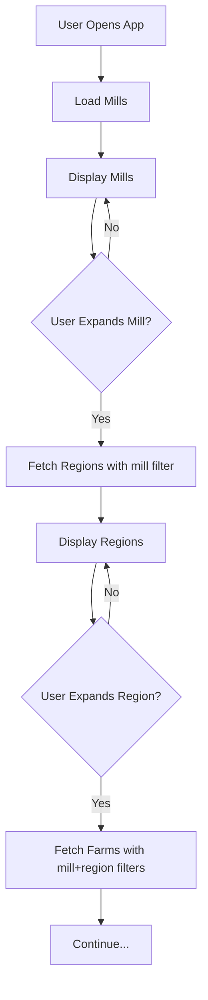

# Land Unit Tree View Guide

Interactive tree view component untuk memvisualisasikan hierarchical land unit structure dengan lazy loading.

## 📋 Features

✅ **Hierarchical Display** - Mill → Region → Farm → Block → Paddock  
✅ **Lazy Loading** - Children di-load hanya saat node di-expand  
✅ **Auto Filtering** - Filter otomatis berdasarkan parent selection  
✅ **Loading States** - Spinner indicators saat loading  
✅ **Error Handling** - Retry mechanism untuk failed requests  
✅ **Count Badges** - Menampilkan jumlah children  
✅ **Responsive** - Scrollable untuk dataset besar  

---

## 🎨 Component Structure

```
LandUnitTreeView
├── hooks/use-landunit.ts       - React Query hooks
├── components/landunit/
│   ├── LandUnitTreeView.tsx    - Main tree component
│   └── index.ts                - Exports
└── DashboardPanel.tsx          - Integration example
```

---

## 🚀 Usage

### Basic Usage

```tsx
import { LandUnitTreeView } from "@/components/landunit";

function MyComponent() {
  return <LandUnitTreeView />;
}
```

### Compact Version (Sidebar)

```tsx
import { LandUnitTreeViewCompact } from "@/components/landunit";

function Sidebar() {
  return (
    <div className="p-4">
      <LandUnitTreeViewCompact />
    </div>
  );
}
```

---

## 🔧 How It Works

### 1. Initial Load
- Component mounts dan fetch **all mills** via `/api/landunit/mill`
- Display mills sebagai root nodes

### 2. User Expands Mill
- Click mill node → fetch regions via `/api/landunit/region?mill=Mill+Name`
- Display regions sebagai children

### 3. User Expands Region
- Click region node → fetch farms via `/api/landunit/farm?mill=X&region=Y`
- Display farms sebagai children

### 4. Continue Down Hierarchy
- Setiap expand akan fetch level berikutnya dengan filters yang tepat
- Leaf nodes (paddocks) tidak memiliki expand button

---

## 📊 Visual Example

```
📁 Jagebob Mill (1)
  ├─ 📁 JAGF (3)
  │   ├─ 📁 Farm A (5)
  │   │   ├─ 📁 Block 1 (10)
  │   │   │   ├─ 📄 Paddock A
  │   │   │   ├─ 📄 Paddock B
  │   │   │   └─ ...
  │   │   └─ ...
  │   └─ ...
  └─ ...
```

---

## 🎯 API Integration

### Hooks Used

```typescript
// Main hook
useLandUnits(level, filters?)

// Convenience hooks
useMills()                    // GET /api/landunit/mill
useRegions(millName?)         // GET /api/landunit/region?mill=X
useFarms({ mill?, region? })  // GET /api/landunit/farm?mill=X&region=Y
useBlocks(filters?)           // GET /api/landunit/block?...
usePaddocks(filters?)         // GET /api/landunit/paddock?...
```

### Example Hook Usage

```typescript
import { useMills, useRegions } from "@/hooks/use-landunit";

function MyComponent() {
  // Fetch all mills
  const { data: mills, isLoading, error } = useMills();

  // Fetch regions for specific mill
  const { data: regions } = useRegions("Jagebob Mill");

  return (
    <div>
      {isLoading && <p>Loading...</p>}
      {error && <p>Error: {error.message}</p>}
      {mills?.data.map(mill => (
        <div key={mill.id}>{mill.name}</div>
      ))}
    </div>
  );
}
```

---

## 🎨 Customization

### Custom Styles

```tsx
<div className="border rounded-lg p-4 bg-card">
  <LandUnitTreeView />
</div>
```

### Custom Height

```tsx
// In LandUnitTreeView.tsx, modify:
<div className="max-h-[600px] overflow-y-auto pr-2">
  {/* Change max-h-[600px] to your desired height */}
</div>
```

### Custom Node Rendering

Modify `TreeNode` component to add custom icons, colors, or actions:

```tsx
// In TreeNode component
<div className="flex items-center gap-2">
  {/* Add custom icon */}
  <YourCustomIcon level={level} />
  
  {/* Add custom badge */}
  {item.status && (
    <Badge variant="outline">{item.status}</Badge>
  )}
  
  <span>{item.name}</span>
</div>
```

---

## 🔄 Data Flow



---

## 📦 Response Format

Tree component consumes API responses in this format:

```json
{
  "success": true,
  "level": "region",
  "count": 3,
  "filters": {
    "mill": "Jagebob Mill"
  },
  "data": [
    {
      "id": "1",
      "name": "JAGF",
      "region_id": "1",
      "region": "JAGF",
      "mill": "Jagebob Mill",
      ...
    }
  ]
}
```

---

## 🚦 States

### Loading State
```tsx
{isLoading && (
  <div className="flex items-center gap-2">
    <Loader2 className="w-4 h-4 animate-spin" />
    <span>Loading...</span>
  </div>
)}
```

### Error State
```tsx
{error && (
  <div className="flex items-center gap-2 text-destructive">
    <AlertCircle className="w-4 h-4" />
    <span>Failed to load</span>
    <button onClick={refetch}>Retry</button>
  </div>
)}
```

### Empty State
```tsx
{data?.data.length === 0 && (
  <div className="text-muted-foreground">
    No items found
  </div>
)}
```

---

## ⚡ Performance

### Caching
- React Query caches responses for 5 minutes
- Same query won't trigger new API call if data is fresh

### Lazy Loading
- Children only fetched when parent expanded
- Reduces initial load time and API calls

### Optimization Tips
1. **Use staleTime** - Adjust based on data freshness needs
2. **Add pagination** - For levels with many items
3. **Virtual scrolling** - For very large datasets
4. **Prefetch** - Prefetch next level on hover

---

## 🐛 Troubleshooting

### Tree Not Loading
```bash
# Check browser console for API errors
# Verify API is running: http://localhost:3000/api/landunit/mill
# Check .env for correct LAND_UNITS_SERVICE_URL
```

### Children Not Appearing
```bash
# Check if expand button is clicked
# Verify filters are correct (case-sensitive!)
# Check API response in Network tab
```

### Performance Issues
```bash
# Too many nodes? Add pagination
# Slow API? Check MapServer performance
# Memory issues? Implement virtual scrolling
```

---

## 🎯 Use Cases

### 1. Data Explorer
```tsx
// Explore entire land unit structure
<LandUnitTreeView />
```

### 2. Selection Interface
```tsx
// Add onClick to nodes for selection
function TreeNode({ item, onSelect }) {
  return (
    <div onClick={() => onSelect(item)}>
      {item.name}
    </div>
  );
}
```

### 3. Map Integration
```tsx
// Filter map based on tree selection
function Dashboard() {
  const [selectedNode, setSelectedNode] = useState(null);
  
  return (
    <>
      <TreeView onNodeClick={setSelectedNode} />
      <Map filter={selectedNode} />
    </>
  );
}
```

### 4. Reporting
```tsx
// Generate reports for selected branch
function Reports() {
  const [selectedMill, setSelectedMill] = useState(null);
  
  return (
    <>
      <TreeView onMillSelect={setSelectedMill} />
      <Report mill={selectedMill} />
    </>
  );
}
```

---

## 📝 Testing

### Manual Testing Checklist
- [ ] Mills load on initial render
- [ ] Expanding mill loads regions
- [ ] Filters are applied correctly
- [ ] Loading spinners appear
- [ ] Error messages display
- [ ] Retry button works
- [ ] Count badges show correct numbers
- [ ] Scroll works for long lists
- [ ] Collapse/expand works smoothly

### Test with Different Data
```bash
# Test with empty data
# Test with single item
# Test with many items (100+)
# Test with deep nesting (all 5 levels)
# Test with API errors
```

---

## 🔗 Related Components

- `LandUnitTreeView` - Full tree view
- `LandUnitTreeViewCompact` - Sidebar version
- `useLandUnits()` - Data fetching hook
- `/api/landunit/[level]` - Backend API

---

## 📚 References

- [React Query Documentation](https://tanstack.com/query/latest)
- [Lucide Icons](https://lucide.dev/)
- [Tailwind CSS](https://tailwindcss.com/)

